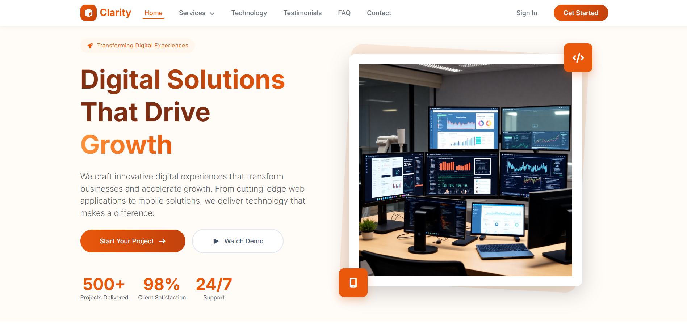

# ✨ Clarity - Digital Solutions Landing Page




## 🚀 Project Overview
This project is a **pixel-perfect** implementation of the "Clarity" landing page design. It focuses on mastering **Bootstrap 5** for layout and components, combined with **pure CSS** for advanced styling and animations.

The main goal was to achieve a responsive, high-quality UI **without writing a single line of custom JavaScript**, relying solely on Bootstrap's built-in functionality and CSS customization.

**🔗 Live Demo:** [Click Here to View](https://rawwann.github.io/clarity-landing-page/)

---

## 🛠️ Tech Stack
* **HTML5** (Semantic structure)
* **CSS3** (Custom styling, Gradients, Transforms, Transitions)
* **Bootstrap 5** (Grid system, Components, Utilities)
* **Font Awesome** (Icons)

---

## 🌟 Key Features & Implementation Details

### 1. Advanced CSS Styling
* **Linear Gradients:** Applied on section backgrounds and main headings (Background-clip: text).
* **Transforms:** Implemented rotation effects for background elements behind images.
* **Micro-Interactions:** Custom hover effects on cards that animate icons and buttons simultaneously.
* **Typography:** Careful attention to letter-spacing and font weights.

### 2. Bootstrap Components Mastery
* **Navbar:** Responsive navigation that highlights the active section on scroll (Scrollspy).
* **Carousel:** Custom styling for indicators with specific hover effects.
* **Navs & Tabs:** Interactive tabbed content with transition effects.
* **Accordion:** Customized border colors and focus states on hover/active.
* **Forms:** Custom focus states for input fields to match the specific design requirements.

### 3. Layout & Responsiveness
* **Grid System:** Fully responsive layout using Bootstrap's container and grid classes.
* **Spacing:** Precise use of margins and padding to ensure **No Horizontal Scroll** issues on any device.
* **Media Queries:** Fine-tuning elements for Mobile and Tablet views.

---

## Project Structure

```
clarity-landing-page/
├── index.html           # Main HTML file
├── CSS/
│   ├── all.min.css     # Font Awesome icons
│   ├── bootstrap.min.css # Bootstrap framework
│   └── style.css        # Custom styling
├── JS/
│   ├── bootstrap.bundle.min.js # Bootstrap JavaScript
├── Fonts/              # Custom fonts
├── Images/             # Project images
├── webfonts/          # Web font files
└── README.md          # This file
```

---

## 💻 How to Run

1.  Clone the repository:
    ```bash
    git clone [https://github.com/Rawwann/clarity-landing-page.git](https://github.com/Rawwann/clarity-landing-page.git)
    ```
2.  Navigate to the project folder.
3.  Open `index.html` in your browser.

---

## 📬 Contact

Implemented by **Rawan Hany**

- 🐙 **GitHub:** [@Rawwann](https://github.com/Rawwann)
- 💼 **LinkedIn:** [Rawan Hany](https://www.linkedin.com/in/rawan-hany-bisstudent/)
- 📧 **Email:** rawanhany2026@email.com

---

Made with ❤️ for amazing digital experiences